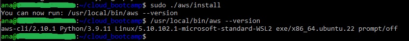

# Week 0 — Billing and Architecture

## Required Task

### Install AWS CLI

Step 1. Download the AWS installation package
```
 $ curl "https://awscli.amazonaws.com/awscli-exe-linux-x86_64.zip" -o "awscliv2.zip"
 ```
 Step 2. Unzip the installation package
```
 $ unzip awscliv2.zip
```
 Step 3. Run the install program
```
 sudo ./aws/install
```
 Step 4. Verify the installation
```
/usr/local/bin/aws --version
```
Output result



