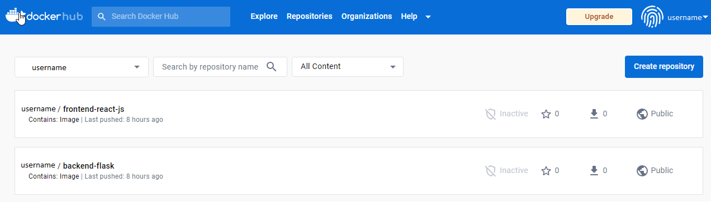

# Week 1 — App Containerization

## Tasks 
1. Run Dockerfile CMD as an external script [DONE]
2. Push and tag a image to DockerHub [DONE]
3. Use multi-stage building for a Docker build [DONE]
4. Implement a healthcheck in the V3 Docker compose file
5. Research best practices for Dockerfiles and implement it in your Dockerfile [DONE]
6. Install Docker on the local machine and get the same containers running outside Gitpod / Codespaces [DONE]
7. Launch an EC2 instance that has Docker installed, and pull a container to run your own Docker processes 

[NOTE] The Docker is already installed on the local machine before performing the following 1-6 tasks. The installation instruction can be easily found on the Internet.

## Task 1: Running Dockerfile CMD as an external script

In a Dockerfile, the 'CMD' instruction is used to specify the command that should be run when a container is started from the image.  
    
        CMD ["python3", "-m", "flask", "run", "--host=0.0.0.0", "--port=4567"]

By default, the command will run the Python3 interpreter and execute flask inside the container's filesystem. <br />

To run the 'CMD' as an external script, it is required to create a Bash/Py file and specify the script's path to the filename instead of the abovementioned command. <br />

   1. Create a Bash script, named ```'script.sh'``` for the backend-flask
        ```
            #!/bin/bash

            python3 -m flask run --host=0.0.0.0 --port=4567
        ```
   2. Modify the CMD command in the Dockerfile
        ```
                CMD ["./script.sh"]
        ```
   3. Build a Docker image with versioning control
        ```
        docker build -t backend-flask:1.0 .
        ```
   4. Run the Docker 
        ``` 
            docker run -p 4567:4567 backend-flask:1.0
        ```
## Task 2: Push and tag an image to Docker Hub

After building Docker images for both frontend and backend apps, tag and push Docker Images by the following commands:

    docker tag backend-flask:2.0 username/backend-flask:1.0
    docker push username/backend-flask:1.0
    
    docker tag frontend-react-js:1.1 username/frontend-react-js:1.0
    docker push username/frontend-react-js:1.0
   
The ```'docker tag'``` command is used to assign a new tag to an existing Docker image. So, the above command was used to tag an existing image called ```'backend-flask:2.0'``` with a new tag ```'username/backend-flask:1.0'```. Then the Docker image was pushed to the Docker Hub repository by the docker push command. 

The result in the Docker Hub repository is below



## Task 3: Use multi-stage building for a Docker build

Multi-stage build of ```Dockerfile```to remove build dependencies for backend-flask application <br />

   Before:

        FROM python:3.10-slim-buster
        WORKDIR /backend-flask
        COPY requirements.txt requirements.txt
        RUN pip3 install -r requirements.txt
        COPY . .
        ENV FLASK_ENV=development
        CMD ["./script.sh"]

   After:

        # Multi-Stage Builds
        # Stage 1: Build
        FROM python:3.10-slim-buster AS build
        WORKDIR /backend-flask
        COPY requirements.txt requirements.txt
        RUN pip3 install -r requirements.txt
        #COPY ..

        # Stage 2: Run
        FROM python:3.10-slim-buster AS run
        WORKDIR /backend-flask
        COPY --from=build /backend-flask /backend-flask
        ENV FLASK_ENV=development
        EXPOSE ${PORT}
        CMD ["bash", "./script.sh"]
    
Build and Run the Dockerfile following the abovementioned commands.

## Task 5: Best Practices for Dockerfiles (which have been applied to Dockerfiles for both frontend and backend apps)

1. Use Official Docker Images as Base Image; Do not install packages by yourself to make Dickefrile cleaner. 
2. Use specific Image Versioning eg. instead of ```FROM node``` use ```FROM node:16.18``` and pick small-sized official images based on smaller OS distro.
3. Use specific Tags for images instead of the default "latest" tag. It helps you identify and distinguish between different versions of the same Docker image.
4. Use ```Multi-Stage builds``` to reduce the size of the final Docker image by using dependencies needed to build the image, not to run the app.
5. Use external scripts if possible to improve modularity and reusability of the build steps.

## Task 6: Launch an EC2 instance that has Docker installed

   1. Install Docker on EC2 using User Data (automate it a bit)
    
        #!/bin/sh
        sudo yum update -y
        sudo amazon-linux-extras install docker
        sudo service docker start
        sudo usermod -a -G docker ec2-user
    
   2. Pull a Docker Image from your Docker Hub account
  
    
   

__
